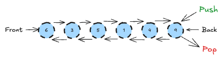
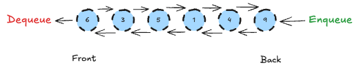
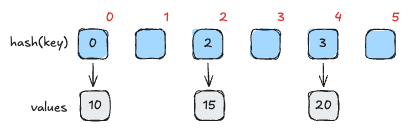
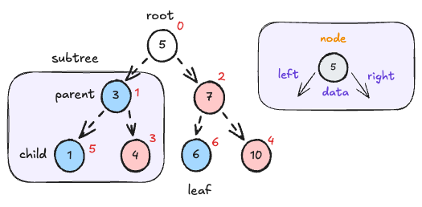

# Week 07 - Cheat Sheet

Create a concise document that contains a summary of the data structures we have covered
this semester. Data structures to be analysed are dynamic array, linked list, stack,
queue, map, and balanced binary search tree.
For the graphic of the data structure, you need to capture the essence
of the data structure and its operations in an image, using arrows, boxes, etc.
You may wish to use Microsoft PowerPoint, Word or Google Slides to help create
it, or you are also welcome to draw your graphic by hand and take a picture of
it to include in the document.

**Purpose and Example (3-5 sentences):** Briefly describe the purpose of the data
structure. Then give an example of a software scenario where you might use this data
structure. Your example should be something from your own creativity and should not be
one of the examples included in the reading.

**Time Complexity of Common Operations:** Document the Big-O time complexity of the
worst case performance to insert a new item into the data structure and to find/retrieve
an item in the collection.

## Dynamic Array

**Purpose:** dynamic array is a flexible data structure that allows the array to perform with
the behavior that extend and at some point shrink. The structure is defined as a fixed array internally given the base features of a static array and increases when capacity hit's the limit by double of the current capacity and copying to a new allocated memory to avoid memory overflow. It can be used to store numbers, characters, strings, objects, and more.

Example: use a dynamic array for listing vehicles with specific characteristics, where it could store objects of a class called car with attributes like brand, make, model, year, and color. Then, with this list could perform operations like filtering and aggregation that relies on attributes like make, model, or color.

**Time Complexity:**

Insert:

- At the beginning: O(n)
- At the end: O(1)

Access:

- Find by value: O(n)
- Find by index: O(1)

## Linked List

**Purpose:** linked list it's a great data structure to handle operations on the edges of the list with great performance on the front and the back of the data structure. It can be used for stack and queue because it works well on the front and the back of the list with great performance by adding and removing from the head and tail of the linked list.

Example: an app that handles notification operations could use a queue list to handle email or text message notifications, this can be helpful when the app needs to respond faster to an order request and notify via email or text message as soon as the order is confirmed, shipped, or delivered.

**Time Complexity:**

Insert:

- At the beginning: O(1)
- At the end: (1)

Access:

- Find by value: O(n)
- Find by index: O(n)

## Stack

**Purpose:** stack is a data structure that can be used with dynamic arrays or linked lists to handle tasks with behavior of last-in first-out. The approach is to insert items in the back of the list and remove from the back. Because the operations happens on the back of the list this data structure can handle fast.

Example: use stack to handle operations that require tracking common tasks that can be reviewed like a chess board that tracks all the previous movements of a game and allow to go backwards to understand what happened on the game on a given moment.

**Time Complexity:**

Insert:

- O(1)

Access:

- The top: O(1)

## Queue

**Purpose:** queue is a data structure that can be used in sequence from the back to the front of the list and a linked list can be used to handle the operations since it works great with operations on the front and on the back of the list. Items are enqueued (added) in the back and dequeued (removed) in the front.

Example: queue can be used with operations that require sequential operations, then it can be used to handle tasks that can take some time consuming to be executed. Then, we could consider an app that handles image processing and because it can take some time to process it would use a queue to handle operations for each item in the queue in a sequence of first-in first-out.

**Time Complexity:**

Insert:

- O(1)

Access:

- The front: O(1)

## Map

**Purpose:** maps are data structure used to store key pair values, the key is hashed and stored based on the hash key to perform fast operations. When adding or changing values the operation keeps the last change with only one value.

Example: it can be used to store defined information like money exchange where the currency would be the key and the value would have the trade value, considering the exchange rate would be against a given currency like dollar.

**Time Complexity:**

Insert:

- O(1)

Access:

- O(1)

## Balanced Binary Search Tree

**Purpose:** balanced binary search trees are data structured used to handle fast operations on data that are stored with lower values to the left and grater values to the right given an root value element. The list contain nodes with left, right, and data attributes. The tree has left and right subtree with parent, child, and leaf nodes. Leaf nodes are considered the nodes on the edges of the subtrees with no child nodes. The list is balanced because the tree should contain the about the same size on both nodes depending on the quantity of nodes inserted, however the balanced BST handle specific operations to adjust nodes according with the given value data.

Example: an example of the balanced BST is a database that uses the data structure to index columns to retrieve data faster.

**Time Complexity:**

Insert:

- To insert a node O(log n)

Access:

- To find a node O(log n)
